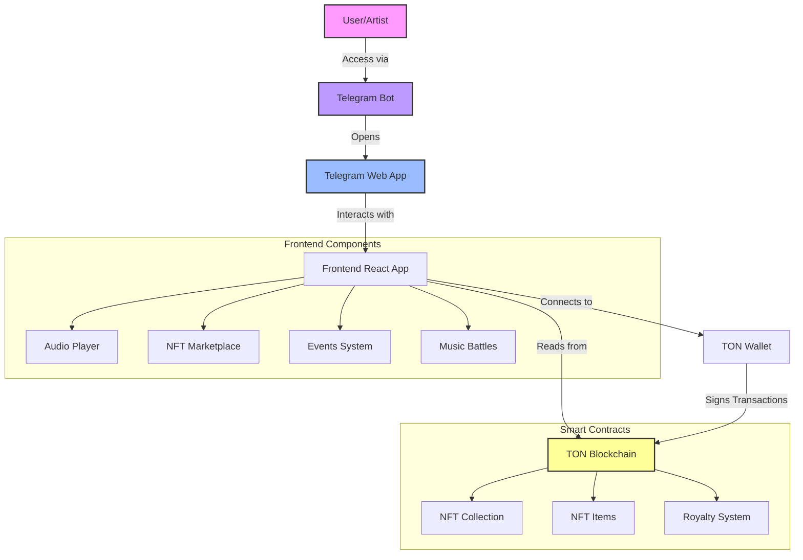
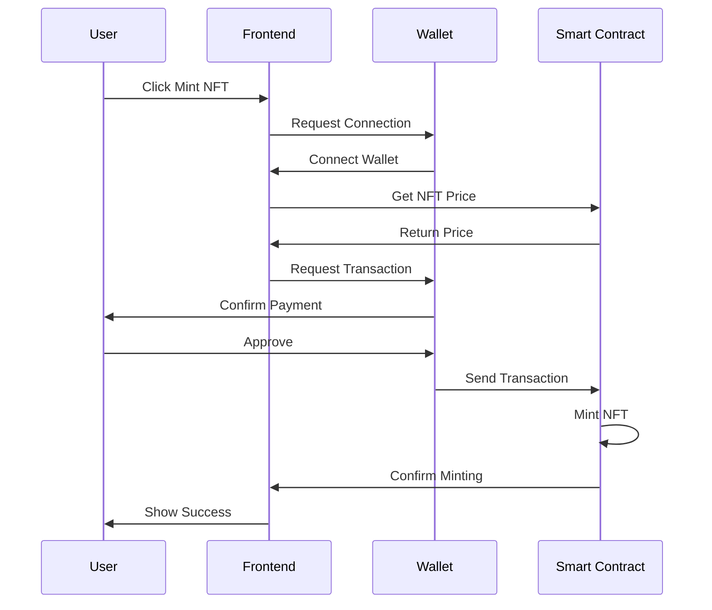
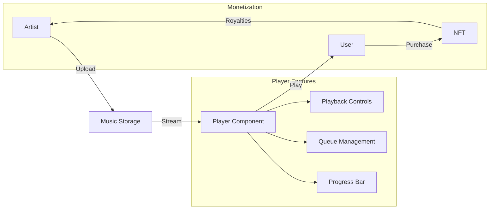

# SonorousTune 🎵

> A decentralized music streaming platform powered by TON blockchain and Telegram

[](https://ary433.github.io/SonorousTune/)
[](https://ton.org/)
[](https://telegram.org/)

## 🌟 Overview

SonorousTune is a revolutionary decentralized music platform that bridges the gap between artists and listeners using blockchain technology. Built on the TON blockchain and integrated with Telegram, it offers a seamless experience for discovering, streaming, and collecting music NFTs.

## ✨ Features

### For Listeners
- 🎧 Stream music directly in the Telegram app
- 💎 Collect exclusive music NFTs
- 🏆 Participate in music battles and events
- 📊 Track your listening stats
- 🎮 Interactive music quests

### For Artists
- 🎼 Showcase your music portfolio
- 🏷️ Mint and sell music NFTs
- 🎫 Create exclusive events
- 📈 Track fan engagement
- 💫 Host music battles

## 🚀 Quick Start

### Using Telegram Bot
1. Open Telegram and search for SonorousTune Bot
2. Click the Menu button to launch the web app
3. Connect your TON wallet (TON Space, TonKeeper, or TonHub)
4. Start exploring music and collecting NFTs!

### Local Development
```bash
# Clone the repository
git clone https://github.com/ary433/SonorousTune.git

# Install dependencies
npm install

# Start development server
npm run dev

# Build for production
npm run build
```

## 🛠️ Technology Stack

### Frontend
- ⚛️ React 18 with TypeScript
- 🎨 Tailwind CSS for styling
- 📱 TWA (Telegram Web App) SDK
- 🔄 Redux Toolkit for state management

### Blockchain
- ⛓️ TON Blockchain
- 📜 FunC for smart contracts
- 🔧 Blueprint for contract testing
- 🌐 TON Connect for wallet integration

### Development Tools
- 📦 Vite for blazing fast builds
- 🔍 ESLint + Prettier for code quality
- 🧪 Jest for testing
- 🚀 GitHub Actions for CI/CD

## 🔄 System Architecture

### System Overview


### NFT Minting Flow


### Music Streaming Architecture



## 🔗 Important Links

- 🌐 [Live Demo](https://ary433.github.io/SonorousTune/)
- 📱 [Telegram Bot](https://t.me/SonoroustuneBot)
- 📖 [TON Documentation](https://ton.org/docs/)


## 🤝 Contributing

We welcome contributions! Please feel free to submit a Pull Request. For major changes, please open an issue first to discuss what you would like to change.

## ⚠️ Important Notice

This platform involves cryptocurrency transactions on the TON blockchain. Please note:
- NFT minting requires TON tokens for both the NFT price and transaction fees
- Always ensure you're connected to the correct network (testnet/mainnet)
- Double-check all transaction details before confirming
- Never share your wallet's private keys or seed phrases

## 📄 License

This project is licensed under the MIT License - see the [LICENSE](LICENSE) file for details.

## 📞 Support
k_sterio
Need help? Reach out to us:
- 💬 [Telegram Support](https://t.me/InvisibleInkhs)

---

<div align="center">
Made with ❤️ by the SonorousTune Team
</div>
